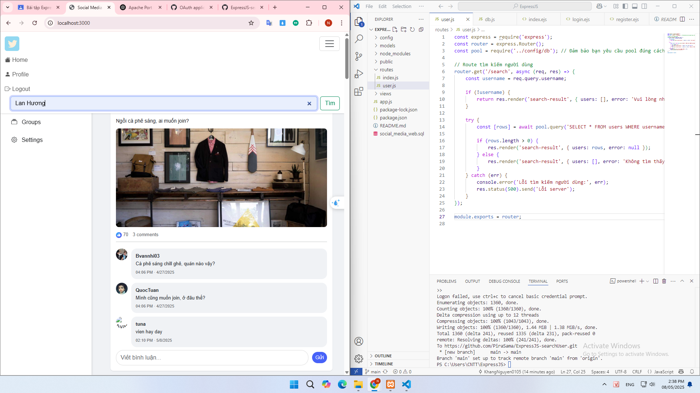
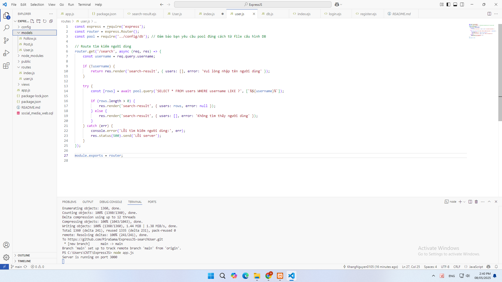

# Social Media Web

A simple social media web application built with Node.js, Express, MySQL, and EJS. Users can register, log in, post updates, like posts, and comment on them.

Màn hình trình duyệt chạy project

Màn hình kết quả tìm kiếm người dùng

Màn hình IDE project
## Table of Contents
- [Features](#features)
- [Prerequisites](#prerequisites)
- [Installation](#installation)
- [Database Setup](#database-setup)
- [Running the Application](#running-the-application)
- [Usage](#usage)
- [Troubleshooting](#troubleshooting)
- [Contributing](#contributing)
- [License](#license)

## Features
- User registration and login.
- Create and view posts with images.
- Like and unlike posts.
- Comment on posts.
- Responsive design with Bootstrap.

## Prerequisites
Before you begin, ensure you have the following installed:
- [Node.js](https://nodejs.org/) (v14 or higher)
- [MySQL](https://www.mysql.com/) (v8.0 or higher)
- [Git](https://git-scm.com/) (for cloning the repository)
- A code editor (e.g., [VS Code](https://code.visualstudio.com/))

## Installation
1. **Clone the Repository**:
   ```bash
   git clone https://github.com/yourusername/social-media-web.git
   cd social-media-web
   ```

2. **Install Dependencies**:
   Install the required Node.js packages using npm:
   ```bash
   npm install
   ```
   This will install dependencies like `express`, `mysql2`, `express-session`, `ejs`, and others listed in `package.json`.

   If you don’t have a `package.json` file, create one by running:
   ```bash
   npm init -y
   ```
   Then install the required packages:
   ```bash
   npm install express mysql2 express-session ejs
   ```

3. **Install Bootstrap (Optional)**:
   The application uses Bootstrap for styling. The `index.ejs` file links to a CDN, but if you prefer a local copy, install Bootstrap:
   ```bash
   npm install bootstrap
   ```
   Ensure the `app.js` file serves the Bootstrap files:
   ```javascript
   app.use('/bootstrap', express.static(path.join(__dirname, 'node_modules/bootstrap/dist')));
   ```

## Database Setup
The application uses MySQL to store user data, posts, comments, and likes. Follow these steps to set up the database:

1. **Start MySQL**:
   Ensure your MySQL server is running. On Windows, you can start it via the MySQL Workbench or command line:
   ```bash
   mysql -u root -p
   ```

2. **Create the Database**:
   Log in to MySQL and create a database named `social_media_web`:
   ```sql
   CREATE DATABASE social_media_web;
   USE social_media_web;
   ```

3. **Import the Database Schema**:
   - Download or copy the `social_media_web_sample_data.sql` file from the repository.
   - Import the SQL file to create tables and populate sample data:
     ```bash
     mysql -u root -p social_media_web < social_media_web_sample_data.sql
     ```
   - Alternatively, in MySQL Workbench:
     - Go to `Server` > `Data Import`.
     - Select `Import from Self-Contained File`, choose `social_media_web_sample_data.sql`, and set the target schema to `social_media_web`.
     - Click `Start Import`.

4. **Verify the Database**:
   Check that the tables (`users`, `posts`, `follows`, `comments`, `likes`) are created and populated:
   ```sql
   SHOW TABLES;
   SELECT * FROM users;
   SELECT * FROM posts;
   ```

5. **Configure Database Connection**:
   Ensure the `app.js` file has the correct MySQL connection details. Update the `pool` configuration if your MySQL user, password, or host differs:
   ```javascript
   const pool = mysql.createPool({
       host: '127.0.0.1',
       user: 'root',
       password: 'admin', // Replace with your MySQL password
       database: 'social_media_web',
       waitForConnections: true,
       connectionLimit: 10,
       queueLimit: 0
   });
   ```

## Running the Application
1. **Start the Server**:
   Run the application using Node.js:
   ```bash
   node app.js
   ```
   You should see:
   ```
   Server is running on port 3000
   ```

2. **Access the Application**:
   Open your browser and navigate to:
   ```
   http://localhost:3000
   ```
   If you’re not logged in, you’ll be redirected to the login page.

## Usage
1. **Register**:
   - Go to `http://localhost:3000/register`.
   - Enter a username and password to create a new account.
   - You’ll be redirected to the login page after successful registration.

2. **Log In**:
   - Go to `http://localhost:3000/login`.
   - Use one of the sample accounts:
     - Username: `admin`, Password: `123` (admin user)
     - Username: `Mai Linh`, Password: `password123` (regular user)
   - Alternatively, use the account you created during registration.

3. **View and Interact with Posts**:
   - After logging in, you’ll see the homepage with a list of posts.
   - Click the "Like" button to like a post. If you’ve already liked it, the button will change to "Unlike".
   - Add a comment by typing in the comment box and clicking "Gửi" (Send).

4. **Navigation**:
   - Use the sidebar to navigate to Home, Profile, Friends, Groups, or Settings.
   - Click "Logout" in the top-right corner to log out.

## Troubleshooting
- **"Cannot connect to MySQL"**:
  - Ensure MySQL is running and the credentials in `app.js` match your MySQL setup.
  - Test your connection:
    ```bash
    mysql -u root -p
    ```
  - Verify the database exists:
    ```sql
    SHOW DATABASES;
    USE social_media_web;
    SHOW TABLES;
    ```

- **"Cannot find module 'express'"**:
  - Ensure you ran `npm install` in the project directory.
  - Check that `node_modules` folder exists and contains `express`.

- **Images Not Loading**:
  - Verify the `image_url` in the `posts` table:
    ```sql
    SELECT image_url FROM posts;
    ```
  - Test the URLs (e.g., `https://picsum.photos/1280/600?random=1`) directly in your browser.
  - Ensure your internet connection is active (the app uses external image URLs).

- **"Cannot GET /"**:
  - Ensure you’re logged in. The root route (`/`) requires authentication.
  - Check the browser console (F12 > Console) for errors and the server logs for more details.

- **Layout Issues**:
  - If images or comments appear misaligned, verify the CSS in `index.ejs` (e.g., `max-width: 800px` for `.post-image` and `.comment-section`).
  - Adjust the `max-width` if needed to fit your screen size.

## Contributing
Contributions are welcome! To contribute:
1. Fork the repository.
2. Create a new branch:
   ```bash
   git checkout -b feature/your-feature-name
   ```
3. Make your changes and commit them:
   ```bash
   git commit -m "Add your feature description"
   ```
4. Push to your branch:
   ```bash
   git push origin feature/your-feature-name
   ```
5. Create a pull request on GitHub.

## License
This project is licensed under the MIT License. See the [LICENSE](LICENSE) file for details.
"# ExpressJS-searchUser" 
